# Manual de usuario

## Requisitos para poder utilizar el programa

1. Tener instalado en la computadora python.
2. tener instalado en la computadora Visual Studio Code.
3. Tener un previsualizador de markdown en Visual Studio Code.

## Botones de Archivo

### Interfaz

Al ejecutar el programa podrá ver la siguiente interfaz:
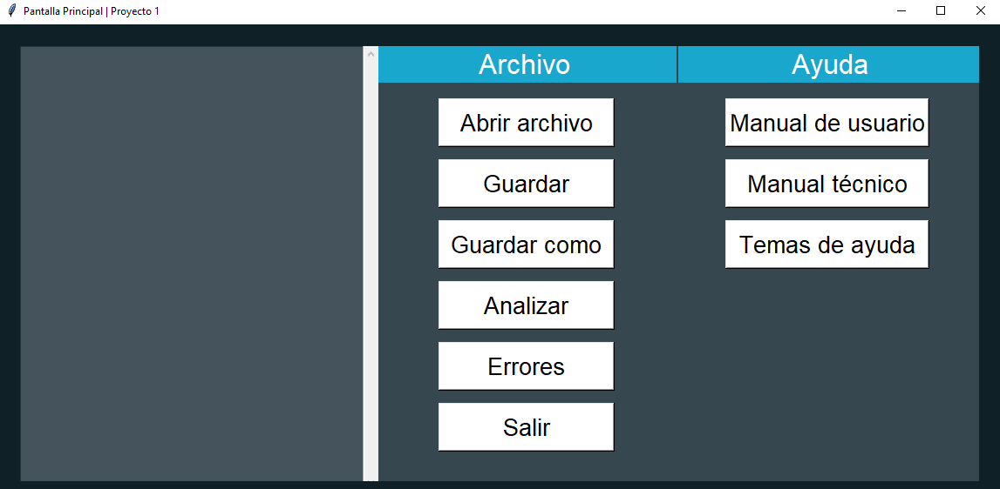

En esta interfaz podrá encontrar diferentes botones que realizan diferentes acciones para el analizador léxico.

### Abrir archivo

El botón abrir archivo permite abrir un archivo de texto plano con diferentes extensiones.

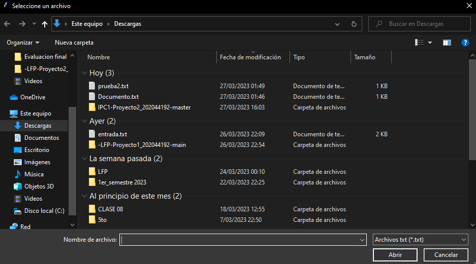

Al abrir el archivo se mostrará en el área de texto de la izquierda la información del archivo. Si el archivo contiene mucha información puede desplazarse con la barra de desplazamiento que se encuentra a la derecha.

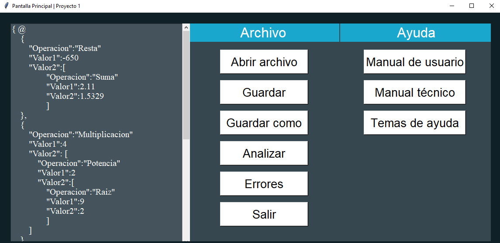

Si al momento de abrir el archivo el documento no es soportado se mostrara la siguiente ventana de error.

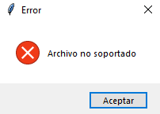

### Guardar

Se puede modificar la información del archivo seleccionado utilizando el area de texto de la izquierda. Para guardar los cambios se debe presionar el botón guardar. Al Guardar el archivo se mostrará la siguiente ventana.

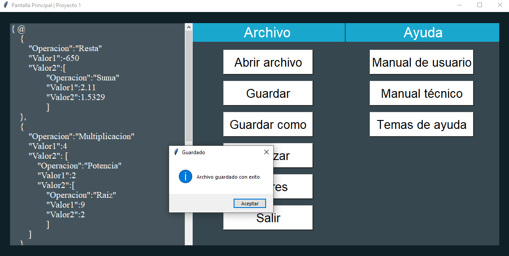

### Guardar como

El botón Guardar como permite guardar el archivo con un nombre diferente al original. Al presionar el botón se mostrará la siguiente ventana.

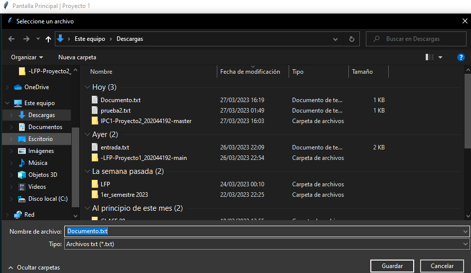

En esta ventana puede seleccionar la ubicación donde se desea guardar el archivo y el nombre del archivo.

### Analizar

El botón analizar permite analizar el archivo abierto. Al presionar el botón se mostrará la siguiente ventana.

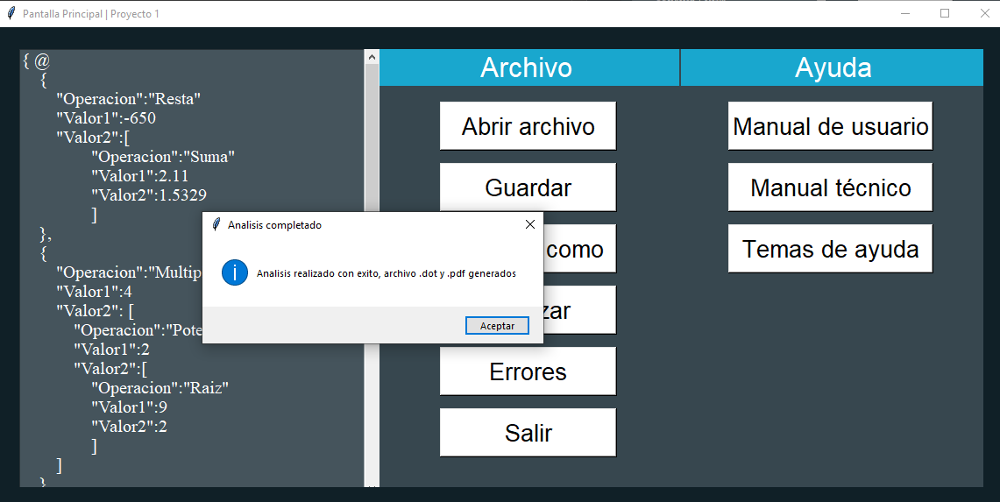

Al realizar el análisis se crea el diagrama de árbol de las diferentes operaciones analizadas, la forma, el color del nodo, el color de fuente y el titulo del gráfico depende de la información del archivo seleccionado. Se creara una archivo .dot y un archivo .pdf con el diagrama de árbol de las operaciones.

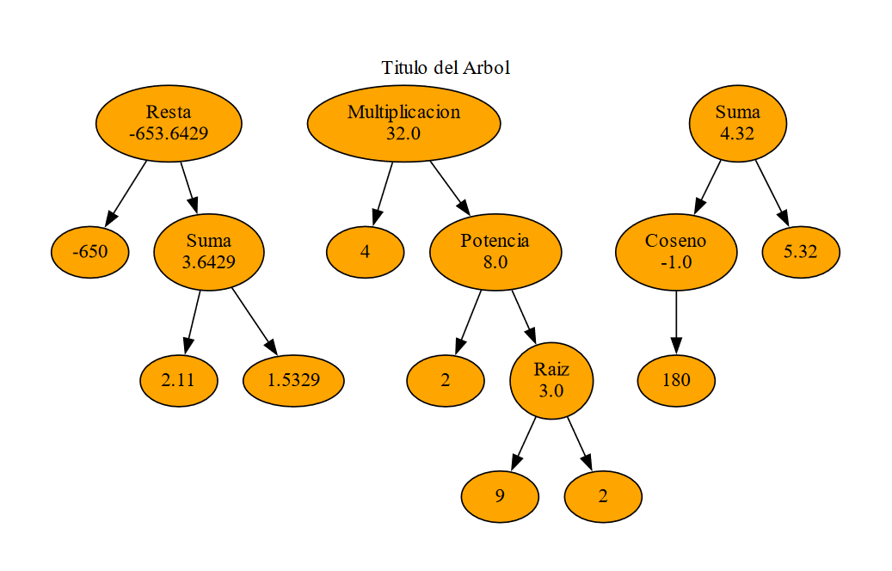

### Errores

El botón de errores permite mostrar los **errores léxicos** encontrados en el archivo seleccionado. Al presionar el botón se mostrará la siguiente ventana.

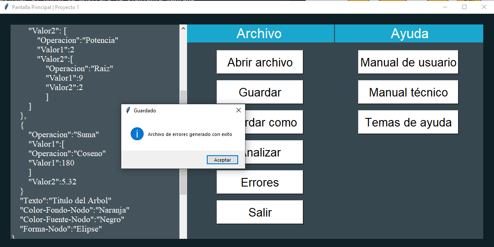

Se creara un archivo .txt con la información de los errores encontrados en formato json llamado **Errores_202044192.json**, este archivo se abrirá automáticamente con el block de notas.

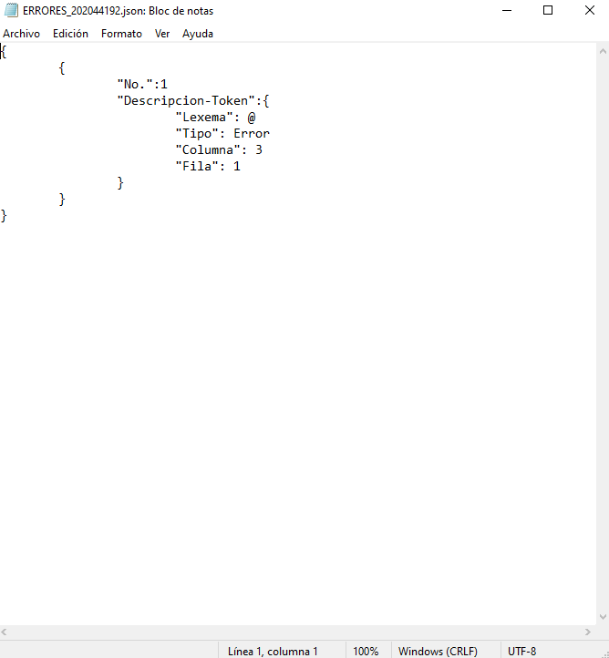

### Salir

El botón salir como su nombre indica permite salir del programa.

## Botones de ayuda

### Manual Técnico

El botón de manual técnico abre el archivo **Manual_tecnico.md** en Visual Studio Code. Este archivo contiene la información técnica de como fue realizado el programa.

### Manual de Usuario

El botón de manual de usuario abre el archivo **Manual_de_usuario.md** en Visual Studio Code. Este archivo contiene la información de como utilizar el programa, siendo este el archivo que se esta leyendo.

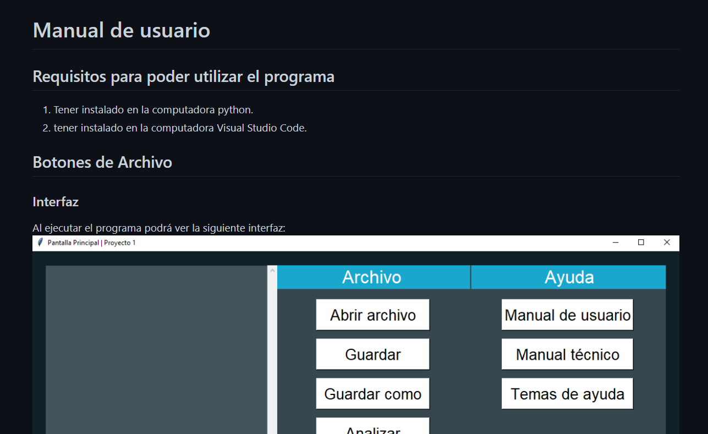

### Temas de ayuda

El botón de temas de ayuda despliega la siguiente ventana con información del creador del programa.

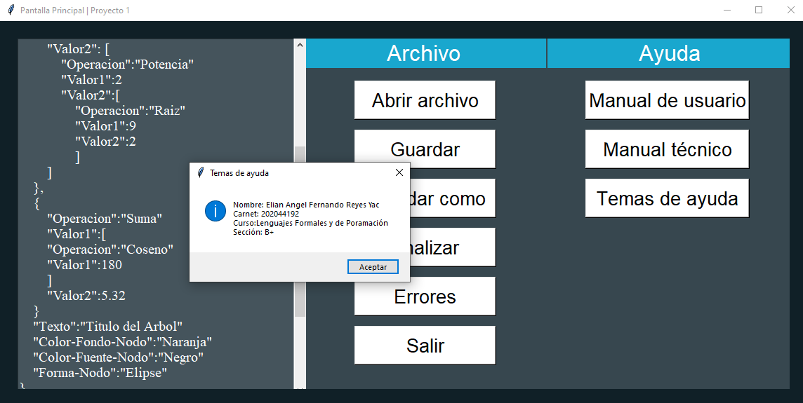
